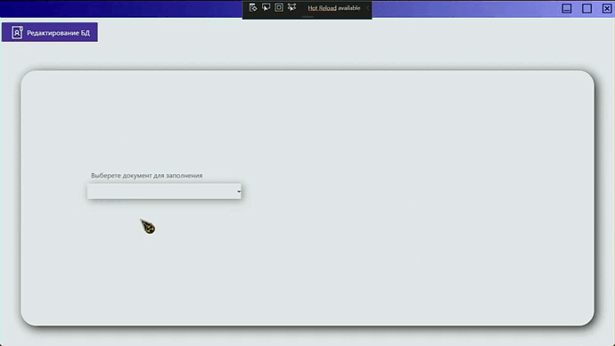
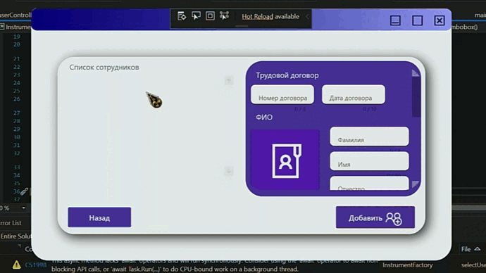

# Заполнитель документов из БД C#
---

***

Это заполнитель документов данными из БД (Firebase) созданный на C#.

Программа поддерживает:

*Редактирование БД

*Добавление шаблонов документов

*Заполнение Шаблонов

---
||
|:--:| 
| *Редактирвание БД* |

||
|:--:| 
| *Сохранение файла* |

***

